# 🐾 Petzy

**Petzy** adalah aplikasi mobile _all-in-one_ untuk pemilik hewan peliharaan — kelola profil hewan, kunjungan dokter hewan, belanja produk, dan chat konsultasi dalam satu aplikasi.

Dibangun dengan **React Native + Expo**, arsitektur **Clean Architecture**, dan state management **Zustand**.

---

## 📸 Fitur Utama

| Fitur          | Deskripsi                                                                                 |
| -------------- | ----------------------------------------------------------------------------------------- |
| 🏠 **Home**    | Dashboard utama dengan featured pets, quick actions, pet care tips, dan artikel kesehatan |
| 🐶 **My Pets** | CRUD lengkap — tambah, edit, hapus, lihat detail hewan peliharaan                         |
| 🏥 **Health**  | Cari dokter hewan, booking janji temu, rekam medis, artikel kesehatan                     |
| 🛒 **Shop**    | Belanja produk pet (Food, Toys, Health, Accessories, Grooming), keranjang, checkout       |
| 💬 **Chat**    | Chat konsultasi real-time dengan dokter hewan                                             |
| 👤 **Profile** | Edit profil, kelola alamat, metode pembayaran, pengaturan, bantuan                        |

---

## 📦 Tech Stack

| Technology                     | Version | Kegunaan                                                                          |
| ------------------------------ | ------- | --------------------------------------------------------------------------------- |
| Expo                           | SDK 54  | Managed workflow & build tools                                                    |
| React Native                   | 0.81.x  | Framework mobile cross-platform                                                   |
| React                          | 19.x    | UI library                                                                        |
| TypeScript                     | 5.x     | Static typing                                                                     |
| Zustand                        | 5.x     | State management                                                                  |
| Axios                          | 1.x     | HTTP client                                                                       |
| React Navigation               | 7.x     | Navigasi (native-stack + bottom-tabs)                                             |
| Expo Font                      | 14.x    | Custom font loading (Outfit)                                                      |
| React Native Toast Message     | 2.x     | Notifikasi toast                                                                  |
| React Native Safe Area Context | 5.x     | Safe area handling                                                                |
| @expo/vector-icons             | 15.x    | Icon library (Ionicons, MaterialCommunityIcons, Feather, AntDesign, FontAwesome5) |

---

## 🏗️ Arsitektur: Clean Architecture

```
┌──────────────────────────────────────────────────┐
│              Presentation Layer                   │
│     Screens · Components · Navigation · Stores    │
├──────────────────────────────────────────────────┤
│                Domain Layer                       │
│        Entities · Use Cases · Repo Interfaces     │
├──────────────────────────────────────────────────┤
│                 Data Layer                        │
│    Repositories · DataSources (Mock / Remote)     │
└──────────────────────────────────────────────────┘
```

**Aturan dependency:** Layer atas boleh mengakses layer bawah, tapi **tidak sebaliknya**.

### Alur Data

```
Screen → Zustand Store → Use Case → Repository (impl) → DataSource (Mock / API)
  ↑                                                             │
  └────────────── return data ←─────────────────────────────────┘
```

---

## 📁 Struktur Folder

```
petzy/
├── assets/
│   └── fonts/                        # Font files (Outfit 5 weights)
├── src/
│   ├── core/                         # Shared utilities & konfigurasi global
│   │   ├── constants/
│   │   │   ├── endpoint.ts           # API endpoint paths
│   │   │   └── env.ts               # Environment config (BASE_URL, MOCK_API toggle)
│   │   ├── data/
│   │   │   └── dummy.ts             # Static data (categories, tips, featured)
│   │   ├── hooks/
│   │   │   └── auth/
│   │   │       ├── useLogin.ts       # Login form hook
│   │   │       └── useRegister.ts    # Register form hook
│   │   ├── store/
│   │   │   ├── authStore.ts          # Auth state (token, user, login/logout)
│   │   │   ├── cartStore.ts          # Shopping cart (items, add/remove/checkout)
│   │   │   ├── petsStore.ts          # Pets CRUD state (load/add/update/remove)
│   │   │   └── settingsStore.ts      # Alamat, payment methods, app preferences
│   │   ├── theme/
│   │   │   ├── colors.ts             # Palet warna (primary, secondary, status)
│   │   │   ├── typography.ts         # Font family, size, typography styles
│   │   │   ├── spacing.ts            # Spacing tokens & border radius
│   │   │   ├── sizes.ts              # Icon sizes
│   │   │   ├── assets.ts             # Asset references
│   │   │   ├── styling.ts            # Shared styling utilities
│   │   │   └── index.ts              # Theme barrel export
│   │   └── utils/
│   │       └── format.ts             # formatCurrency, formatDateTime, formatRelativeTime
│   │
│   ├── data/                         # Layer data — implementasi akses data
│   │   ├── datasources/
│   │   │   ├── local/                # Local storage (AsyncStorage, MMKV)
│   │   │   ├── remote/
│   │   │   │   └── apiClient.ts      # Axios instance + interceptors
│   │   │   └── mock/
│   │   │       ├── mockUtils.ts      # mockDelay(), mockId()
│   │   │       └── seed.ts           # Semua mock data (pets, products, vets, dll)
│   │   ├── models/
│   │   │   └── AuthDto.ts            # Auth response DTO
│   │   └── repositories/
│   │       ├── authRepository.ts     # Auth (login, register, refresh)
│   │       ├── petRepository.ts      # CRUD pets (in-memory store)
│   │       ├── productRepository.ts  # Get products & by category/id
│   │       ├── vetRepository.ts      # Get vets & by id
│   │       ├── appointmentRepository.ts  # Appointments CRUD
│   │       ├── chatRepository.ts     # Chat threads & messages
│   │       └── articleRepository.ts  # Articles list & detail
│   │
│   ├── domain/                       # Layer domain — business logic murni
│   │   ├── entities/
│   │   │   ├── User.ts              # Auth tokens + profile
│   │   │   ├── Pet.ts               # Pet (species, breed, weight, vaccinated)
│   │   │   ├── Product.ts           # Product (category, price, discount)
│   │   │   ├── Vet.ts               # Vet (specialty, rating, price)
│   │   │   ├── Appointment.ts       # Appointment (status: upcoming/completed/cancelled)
│   │   │   ├── Chat.ts              # ChatThread + ChatMessage
│   │   │   └── Article.ts           # Article (title, excerpt, category)
│   │   ├── repositories/
│   │   │   ├── IAuthRepository.ts
│   │   │   ├── IPetRepository.ts     # getAll, getMine, getById, create, update, remove
│   │   │   ├── IProductRepository.ts # getAll, getByCategory, getById
│   │   │   ├── IVetRepository.ts     # getAll, getById
│   │   │   ├── IAppointmentRepository.ts  # getAll, getUpcoming, getById, book, cancel
│   │   │   ├── IChatRepository.ts    # getThreads, getMessages, sendMessage
│   │   │   └── IArticleRepository.ts # getAll, getById
│   │   └── usecases/
│   │       ├── LoginUseCase.ts
│   │       ├── RegisterUseCase.ts
│   │       ├── RefreshTokenUseCase.ts
│   │       ├── PetUseCases.ts        # getPets, getMyPets, getPetById, createPet, updatePet, removePet
│   │       ├── ProductUseCases.ts    # getProducts, getProductsByCategory, getProductById
│   │       ├── VetUseCases.ts        # getVets, getVetById
│   │       ├── AppointmentUseCases.ts # getAppointments, getUpcoming, getById, book, cancel
│   │       ├── ChatUseCases.ts       # getChatThreads, getChatMessages, sendChatMessage
│   │       └── ArticleUseCases.ts    # getArticles, getArticleById
│   │
│   ├── presentation/                 # Layer presentasi — semua yang dilihat user
│   │   ├── components/
│   │   │   ├── AuthComponents.tsx    # InputField, PrimaryButton
│   │   │   ├── CustomTabBar.tsx      # Bottom tab navigation (avatar + cart badge)
│   │   │   ├── ScreenHeader.tsx      # Reusable header (title, subtitle, back, right action)
│   │   │   ├── Section.tsx           # Content section wrapper
│   │   │   ├── Badge.tsx             # Status/tag badge
│   │   │   ├── EmptyState.tsx        # Empty data placeholder
│   │   │   ├── Divider.tsx           # "Or" separator line
│   │   │   ├── FeaturedCard.tsx      # Featured pet card (home)
│   │   │   ├── PetcareCard.tsx       # Pet care service card
│   │   │   └── SosmedAccount.tsx     # Social media login buttons
│   │   │
│   │   ├── navigation/
│   │   │   ├── RootNavigator.tsx     # Switch auth ↔ app berdasarkan isAuthenticated
│   │   │   ├── AuthNavigator.tsx     # Stack: Login ↔ Register
│   │   │   ├── AppNavigator.tsx      # Tabs + 20 stack screens
│   │   │   └── types.ts             # Type definitions (AuthStack, AppTab, AppStack)
│   │   │
│   │   └── screens/
│   │       ├── NotificationsScreen.tsx
│   │       ├── auth/
│   │       │   ├── LoginScreen.tsx
│   │       │   ├── RegisterScreen.tsx
│   │       │   └── authScreenStyles.ts
│   │       ├── home/
│   │       │   ├── HomeScreen.tsx
│   │       │   ├── home.styles.tsx
│   │       │   └── components.tsx     # Header, categories, featured, tips
│   │       ├── chat/
│   │       │   ├── ChatScreen.tsx      # Thread list
│   │       │   └── ChatRoomScreen.tsx  # 1-on-1 chat room
│   │       ├── health/
│   │       │   ├── HealthScreen.tsx          # Pet vitals, quick actions, vets, appointments
│   │       │   ├── BookAppointmentScreen.tsx # Form booking janji temu
│   │       │   ├── VetDetailScreen.tsx       # Profil dokter hewan lengkap
│   │       │   ├── AppointmentsScreen.tsx    # Daftar janji (tab: upcoming/completed/cancelled)
│   │       │   ├── AppointmentDetailScreen.tsx  # Detail janji + cancel
│   │       │   └── ArticleDetailScreen.tsx   # Artikel kesehatan hewan
│   │       ├── pets/
│   │       │   ├── PetFormScreen.tsx    # Form tambah/edit pet
│   │       │   └── PetDetailScreen.tsx  # Detail pet + timeline + quick actions
│   │       ├── profile/
│   │       │   ├── ProfileScreen.tsx    # Menu utama profil
│   │       │   ├── MyPetsScreen.tsx     # Daftar hewan peliharaan
│   │       │   ├── EditProfileScreen.tsx     # Edit nama, email, bio, avatar
│   │       │   ├── AddressesScreen.tsx       # Kelola alamat pengiriman
│   │       │   ├── AddressFormScreen.tsx      # Form tambah/edit alamat
│   │       │   ├── PaymentMethodsScreen.tsx  # Kelola kartu & e-wallet
│   │       │   ├── SettingsScreen.tsx        # Notifikasi, tampilan, keamanan
│   │       │   ├── HelpScreen.tsx            # Bantuan + FAQ
│   │       │   └── AboutScreen.tsx           # Info aplikasi + links
│   │       └── shop/
│   │           ├── ShopScreen.tsx       # Katalog produk + filter kategori
│   │           ├── CartScreen.tsx       # Keranjang belanja
│   │           ├── ProductDetailScreen.tsx  # Detail produk + qty selector
│   │           ├── CheckoutScreen.tsx   # Alamat, pengiriman, pembayaran, ringkasan
│   │           └── OrderSuccessScreen.tsx   # Halaman sukses pesanan
│   │
│   └── services/                     # External services (push notif, analytics)
│
├── App.tsx                           # Entry point (font loading + navigation + toast)
├── app.json                          # Konfigurasi Expo
├── package.json                      # Dependencies & scripts
└── tsconfig.json                     # TypeScript config (path alias @/*)
```

---

## 🔀 Navigasi

### Navigator Structure

```mermaid
graph TD
    ROOT[RootNavigator] -->|isAuthenticated = false| AUTH[AuthNavigator]
    ROOT -->|isAuthenticated = true| APP[AppNavigator]

    AUTH --> LOGIN[LoginScreen]
    AUTH --> REGISTER[RegisterScreen]

    APP --> TABS[Bottom Tabs]
    TABS --> HOME[Home]
    TABS --> HEALTH[Health]
    TABS --> SHOP[Shop]
    TABS --> CHAT[Chat]
    TABS --> PROFILE[Profile]

    APP --> CART[Cart]
    APP --> PRODUCT_DETAIL[ProductDetail]
    APP --> CHECKOUT[Checkout]
    APP --> ORDER_SUCCESS[OrderSuccess]

    APP --> CHAT_ROOM[ChatRoom]

    APP --> MY_PETS[MyPets]
    APP --> PET_DETAIL[PetDetail]
    APP --> PET_FORM[PetForm]

    APP --> BOOK_APPT[BookAppointment]
    APP --> VET_DETAIL[VetDetail]
    APP --> APPOINTMENTS[Appointments]
    APP --> APPT_DETAIL[AppointmentDetail]
    APP --> ARTICLE_DETAIL[ArticleDetail]

    APP --> EDIT_PROFILE[EditProfile]
    APP --> ADDRESSES[Addresses]
    APP --> ADDRESS_FORM[AddressForm]
    APP --> PAYMENT_METHODS[PaymentMethods]
    APP --> SETTINGS[Settings]
    APP --> HELP[Help]
    APP --> ABOUT[About]
    APP --> NOTIFICATIONS[Notifications]
```



### Stack Screen Parameters

| Route               | Params                               | Animasi           |
| ------------------- | ------------------------------------ | ----------------- |
| `Tabs`              | —                                    | default           |
| `Cart`              | —                                    | slide_from_right  |
| `ProductDetail`     | `{ productId: string }`              | slide_from_right  |
| `Checkout`          | —                                    | slide_from_right  |
| `OrderSuccess`      | `{ orderId: string, total: number }` | fade              |
| `ChatRoom`          | `{ threadId, name, avatarUrl }`      | slide_from_right  |
| `MyPets`            | —                                    | slide_from_right  |
| `PetDetail`         | `{ petId: string }`                  | slide_from_right  |
| `PetForm`           | `{ petId?: string }`                 | slide_from_bottom |
| `BookAppointment`   | `{ vetId?: string }`                 | slide_from_right  |
| `VetDetail`         | `{ vetId: string }`                  | slide_from_right  |
| `Appointments`      | —                                    | slide_from_right  |
| `AppointmentDetail` | `{ appointmentId: string }`          | slide_from_right  |
| `ArticleDetail`     | `{ articleId: string }`              | slide_from_right  |
| `EditProfile`       | —                                    | slide_from_right  |
| `Addresses`         | —                                    | slide_from_right  |
| `AddressForm`       | `{ addressId?: string }`             | slide_from_bottom |
| `PaymentMethods`    | —                                    | slide_from_right  |
| `Settings`          | —                                    | slide_from_right  |
| `Help`              | —                                    | slide_from_right  |
| `About`             | —                                    | slide_from_right  |
| `Notifications`     | —                                    | slide_from_right  |

---

## 🧩 User Flows

### 🔐 Auth Flow

```
Login/Register → Zustand authStore → Repository → API / Mock
      ↕                                              │
  Toast notification  ←──────────────────────────────┘
```

- **Belum login** → `AuthNavigator` (Login ↔ Register)
- **Sudah login** → `AppNavigator` (Bottom Tabs + Stack Screens)
- Mock API menggunakan [reqres.in](https://reqres.in) — email: `eve.holt@reqres.in`, password: `cityslicka`
- Toggle mock/real via `ENV.MOCK_API` di `src/core/constants/env.ts`

### 🐶 Pet Management Flow

```
MyPets → [+] → PetForm (create) → petsStore.add()
MyPets → [tap card] → PetDetail → [edit] → PetForm (edit) → petsStore.update()
PetDetail → [delete] → petsStore.remove() → goBack
```

- Species: Dog, Cat, Rabbit, Bird, Other
- Fields: name, species, breed, age, weight, gender, vaccinated
- Data tersimpan di in-memory store via `petsStore`

### 🛒 Shopping Flow

```
Shop → [tap product] → ProductDetail → Add to Cart → Cart → Checkout → OrderSuccess
                                      → Buy Now ──────────→ Checkout → OrderSuccess
```

- Keranjang di-manage oleh `cartStore` (increment, decrement, remove)
- Checkout: pilih alamat, shipping method (Standard Rp15.000 / Express Rp35.000), payment method
- Order success me-reset navigation stack ke Tabs

### 🏥 Health Flow

```
Health → [tap vet] → VetDetail → Book
Health → [tap appointment] → AppointmentDetail → Cancel
Health → Records/Vaccines → Appointments (tab filter: upcoming/completed/cancelled)
Health → [tap article] → ArticleDetail
```

### 👤 Profile & Settings Flow

```
Profile → Edit Profile      → EditProfileScreen (avatar, name, email, bio)
Profile → My Pets           → MyPetsScreen → PetDetail / PetForm
Profile → My Appointments   → AppointmentsScreen
Profile → My Cart           → CartScreen
Profile → Payment Methods   → PaymentMethodsScreen (modal tambah Visa/Mastercard/GoPay/OVO/BCA)
Profile → Addresses         → AddressesScreen → AddressFormScreen
Profile → Privacy & Security → SettingsScreen (notif, dark mode, bahasa)
Profile → Help & Support    → HelpScreen (contact via email/WhatsApp/phone + FAQ)
Profile → About Petzy       → AboutScreen (versi, terms, privacy, licenses)
```

---

## 🗄️ State Management (Zustand)

### authStore

```typescript
{
  token: string | null;
  refreshToken: string | null;
  isAuthenticated: boolean;
  user: UserProfile | null;
  isLoading: boolean;
  // Actions: login(), register(), refreshSession(), logout(), updateProfile()
}
```

### cartStore

```typescript
{
  items: CartItem[]  // { product: Product, qty: number }
  // Actions: add(), remove(), increment(), decrement(), clear()
  // Computed: totalItems(), totalPrice()
  // Helper: productDisplayPrice() — hitung diskon
}
```

### petsStore

```typescript
{
  pets: Pet[]
  loading: boolean
  // Actions: load(), add(input), update(id, patch), remove(id), getById(id)
}
```

### settingsStore

```typescript
{
  addresses: Address[]         // label, recipient, phone, line, city, postalCode, isDefault
  paymentMethods: PaymentMethod[]  // brand (Visa/Mastercard/GoPay/OVO/BCA), last4, isDefault
  preferences: AppPreferences  // pushNotifications, emailNotifications, promotions, darkMode, language
  // Actions: add/update/remove/setDefault (address & payment), setPreference()
}
```

---

## 🎨 Design System

### Warna

| Token           | Hex       | Kegunaan               |
| --------------- | --------- | ---------------------- |
| `primary`       | `#ff6464` | Aksi utama, CTA, aksen |
| `primaryDark`   | `#ff8D4D` | Gradient / hover       |
| `secondary`     | `#ffBA69` | Aksen sekunder         |
| `secondaryDark` | `#5A2828` | Dark accent            |
| `background`    | `#F5F5F5` | Background layar       |
| `surface`       | `#FFFFFF` | Card / container       |
| `textPrimary`   | `#1A1A1A` | Teks utama             |
| `textSecondary` | `#757575` | Teks pendukung         |
| `success`       | `#4CAF50` | Status berhasil        |
| `warning`       | `#FFC107` | Status peringatan      |
| `error`         | `#F44336` | Status error           |
| `info`          | `#2196F3` | Status informasi       |

### Font — Outfit (Google Fonts)

| Weight | Family            | Kegunaan                |
| ------ | ----------------- | ----------------------- |
| 300    | `Outfit-Light`    | Body text, small        |
| 400    | `Outfit-Regular`  | Subtitle, caption       |
| 500    | `Outfit-Medium`   | Body medium, subtitle 1 |
| 600    | `Outfit-SemiBold` | Title, button           |
| 700    | `Outfit-Bold`     | Heading tebal           |

### Typography Scale

| Style        | Font     | Size |
| ------------ | -------- | ---- |
| `title`      | SemiBold | 40px |
| `subtitle1`  | Medium   | 30px |
| `subtitle2`  | Regular  | 24px |
| `body`       | Light    | 16px |
| `bodyMedium` | Medium   | 14px |
| `button`     | SemiBold | 14px |
| `caption`    | Regular  | 12px |
| `small`      | Light    | 10px |

### Spacing & Border Radius

| Token  | Value |     | Token               | Value |
| ------ | ----- | --- | ------------------- | ----- |
| `xs`   | 4     |     | `BorderRadius.sm`   | 4     |
| `sm`   | 8     |     | `BorderRadius.md`   | 8     |
| `md`   | 12    |     | `BorderRadius.lg`   | 12    |
| `lg`   | 16    |     | `BorderRadius.xl`   | 16    |
| `xl`   | 20    |     | `BorderRadius.xxl`  | 24    |
| `xxl`  | 24    |     | `BorderRadius.full` | 9999  |
| `xxxl` | 32    |     |                     |       |

---

## 🧱 Reusable Components

| Component       | Props                                                               | Kegunaan                                     |
| --------------- | ------------------------------------------------------------------- | -------------------------------------------- |
| `ScreenHeader`  | `title`, `subtitle?`, `onBack?`, `right?`                           | Header layar dengan tombol back & aksi kanan |
| `Section`       | `title`, `action?`, `children`, `paddingHorizontal?`                | Pembungkus section konten                    |
| `Badge`         | `label`, `color`, `background`                                      | Badge status/tag                             |
| `EmptyState`    | `icon`, `title`, `description`, `actionLabel?`, `onAction?`         | Placeholder data kosong                      |
| `InputField`    | `label`, `value`, `onChangeText`, `placeholder`, `secureTextEntry?` | Input field form                             |
| `PrimaryButton` | `title`, `onPress`, `isLoading?`, `disabled?`                       | Tombol CTA utama                             |
| `CustomTabBar`  | `BottomTabBarProps`                                                 | Bottom navigation tab bar                    |
| `Divider`       | —                                                                   | Garis pemisah "Or"                           |
| `FeaturedCard`  | `title`, `icon`, `bgColor`, `large?`, `onPress?`                    | Kartu kategori/fitur di home                 |
| `PetcareCard`   | `title`, `distance`, `reviews`, `image`                             | Kartu layanan pet care                       |

---

## ⚙️ Environment Config

File: `src/core/constants/env.ts`

| Variable      | Default                   | Deskripsi                    |
| ------------- | ------------------------- | ---------------------------- |
| `BASE_URL`    | `https://api.petzy.local` | API base URL                 |
| `API_TIMEOUT` | `15000`                   | Request timeout (ms)         |
| `MOCK_API`    | `true`                    | Toggle mock data vs real API |
| `EMULATOR`    | `false`                   | Flag deteksi emulator        |

### Mock Data

Saat `MOCK_API = true`, semua data menggunakan seed dari `src/data/datasources/mock/seed.ts`:

- **4 pets** (Golden Retriever, Persian, Beagle, Husky) + **2 my pets**
- **6+ products** (Food, Toys, Health, Accessories, Grooming)
- **3+ vets** (General, Dermatology, Surgery, dll)
- **Chat threads** dengan pre-seeded messages
- **Upcoming appointments**
- **Articles** kesehatan hewan

`mockDelay()` mensimulasikan latensi API (400ms default), `mockId()` membuat ID unik.

---

## 🚀 Menjalankan Aplikasi

### Prerequisites

- Node.js 18+
- npm atau yarn
- Expo CLI (`npx expo`)
- Android Studio (untuk Android) / Xcode (untuk iOS)

### Instalasi & Run

```bash
# Clone repository
git clone <repository-url>
cd petzy

# Install dependencies
npm install

# Jalankan Expo dev server
npm start

# Jalankan di Android
npm run android

# Jalankan di iOS
npm run ios

# Jalankan di Web
npm run web
```

### Scripts

| Script            | Perintah               | Kegunaan                    |
| ----------------- | ---------------------- | --------------------------- |
| `npm start`       | `expo start`           | Menjalankan Expo dev server |
| `npm run android` | `expo start --android` | Build & run di Android      |
| `npm run ios`     | `expo start --ios`     | Build & run di iOS          |
| `npm run web`     | `expo start --web`     | Build & run di Web browser  |
| `npm run lint`    | `eslint .`             | Cek kode dengan ESLint      |

---

## 📐 Konvensi Kode

### Use Case Pattern

Semua use case menggunakan pola _curried function_ — menerima repository lalu mengembalikan fungsi aksi:

```typescript
export const loginUseCase =
  (repo: IAuthRepository) => (email: string, password: string) =>
    repo.login(email, password);
```

### Path Alias

TypeScript path alias `@/*` mengarah ke folder `src/`:

```typescript
import {Colors} from "@/core/theme";
import {Pet} from "@/domain/entities/Pet";
```

### Store Pattern

Zustand stores menggunakan pola _selector_ untuk optimalisasi re-render:

```typescript
const pets = usePetsStore((s) => s.pets);
const loading = usePetsStore((s) => s.loading);
```

### Component Pattern

- Setiap screen menggunakan `SafeAreaView` dengan `edges={["top"]}`
- Header menggunakan komponen `ScreenHeader` yang reusable
- Bottom fixed footer menggunakan `position: "absolute"` + padding bottom pada scroll content

---

## 📊 Ringkasan Statistik

| Kategori                   | Jumlah            |
| -------------------------- | ----------------- |
| Entities                   | 7                 |
| Repository Interfaces      | 7                 |
| Repository Implementations | 7                 |
| Use Case Files             | 9 (~30 functions) |
| Zustand Stores             | 4                 |
| Reusable Components        | 10                |
| Screens                    | 27                |
| Navigation Routes          | 22                |
| Utility Functions          | 4                 |

---

## 📝 Lisensi

Private project — hak cipta dilindungi.
